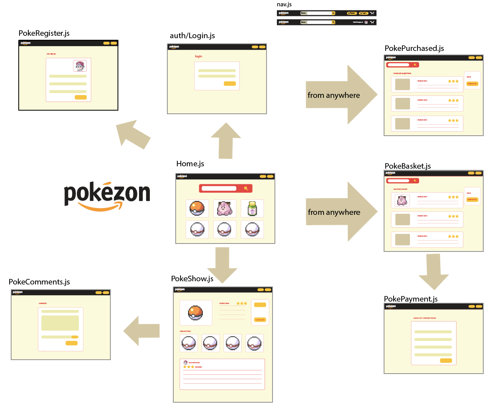
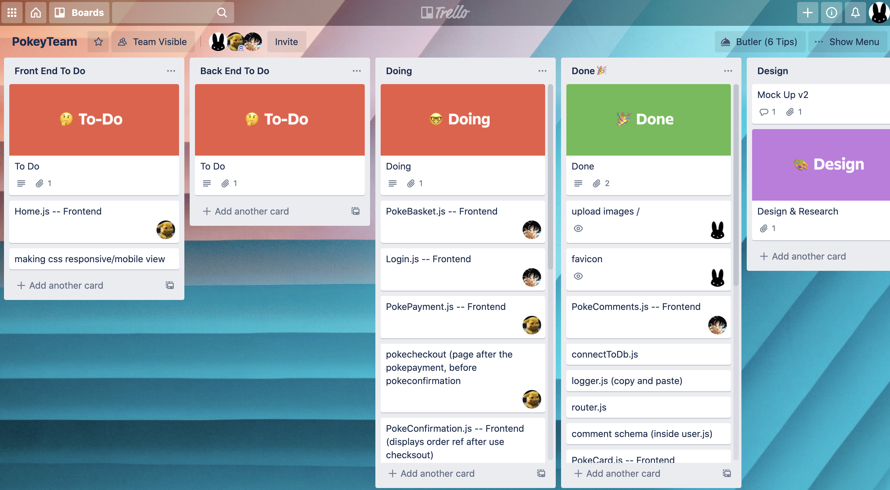
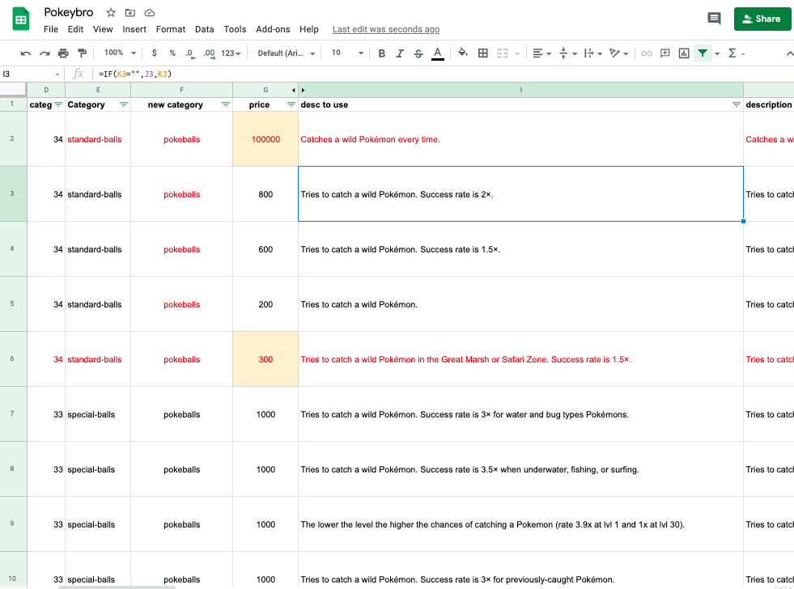
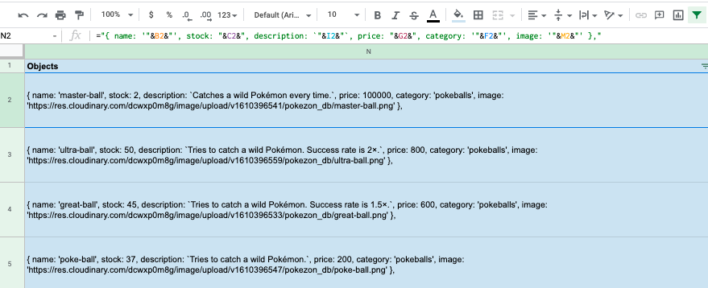
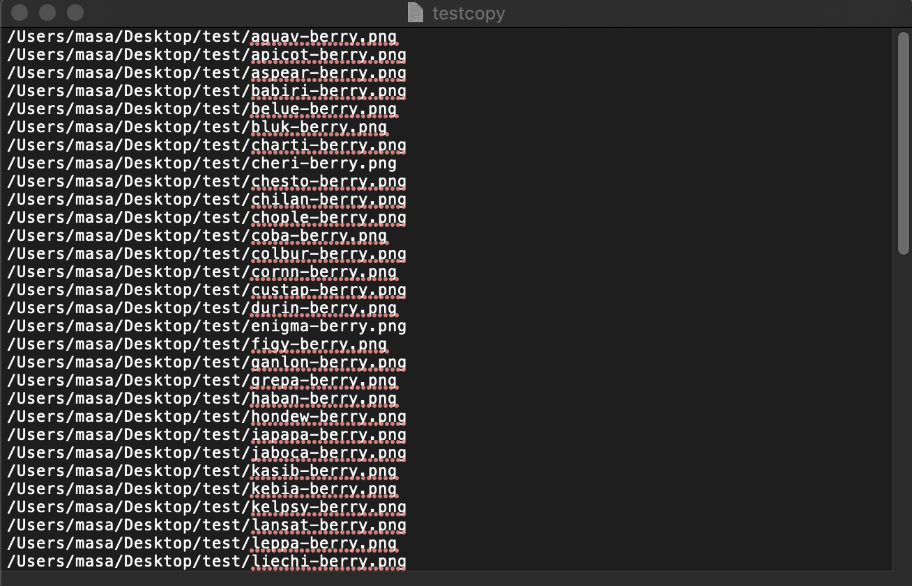
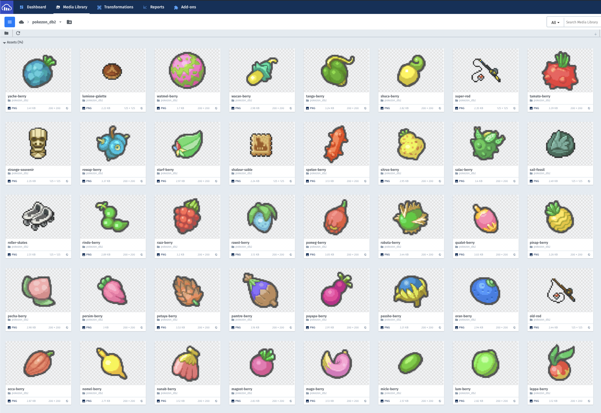
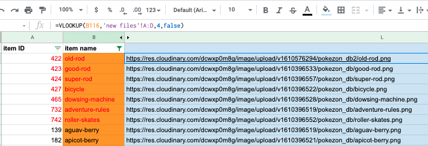

# Project 3: Pokézon

## Index
* [Overview](./README.md#overview)
* [Brief](./README.md#brief)
* [Technologies Used](./README.md#technologies-used)
* [Approach](./README.md#approach)
	* [Mock Up](./README.md#mock-up)
	* [Requesting Data from the API](./README.md#requesting-data-from-the-api)
	* [Displaying Details of Individual Pokémon](./README.md#displaying-details-of-individual-pokémon)
	* [Styling and Animation](./README.md#styling-animation)
    * [Background](./README.md#background)
    * [Hover Effects](./README.md#hover-effects)
    * [Animation for Pokémon Entering the Page](./README.md#animation-for-pokémon-entering-the-page)
* [Final Thoughts](./README.md#final-thoughts)
	* [Wins and Challenges](./README.md#wins-and-challenges)
	* [Key Learnings](./README.md#key-learnings)


(Click [here](https://pokezonshop.herokuapp.com/) to see project. Following login detail can be used for access: email: 'masa@email.com' , password: 'pass')


<br/>

## Overview 

For the third Project at General Assembly's Software Engineering Immersive Course, we were given 10 days to create a fullstack web application, in group of three. At the time, this was the biggest project I had worked on, and also the first time to develop a website using Git as a team. 

Since the Course was taken remotely, we communicated extensively through Slack, Zoom, Trello and GitHub. As well as gaining further coding experience, it was a great opportunity to get a taste of collaborative web development.

We based our project on the popular online shopping platform, Amazon, but with a twist - the store would sell fictional products from the Pokémon game. Most of the assets and data comes from the original game, which had been collected and shared by Pokémon fan online - [Veekun](https://veekun.com) was an excellent resource. The data was recompiled and edited slightly to suit the concept of our project.


<br/>

## Brief
* To build a full-stack application, making our own backend and frontend
* To Use an Express API to serve data from a Mongo database
* To build the frontend using React to consume the API
* The API should have multiple relationships and CRUD functionality for at least a couple of models


## Technologies Used
* HTML5
* CSS3 with animation
* JavaScript (ES6)
* React
* MongoDB
* Express
* Insomnia
* Heroku
* Trello
* Git
* GitHub
* Cloudinary
* Google Chrome dev tools
* Google Sheets
* VScode
* Eslint
* Photoshop
* Illustrator


<br/>


## Approach
### Mockup

First, we planned the rough structure of our website by looking at the real Amazon site. Since we only had a limited time, we decided to take core elements of Amazon, which we felt were:
  * User registration
  * User login
  * Searching for item
  * Adding item to shopping item
  * Checking out (buying the item)*
  * Leaving a review / comment in the item page
  * Deleting comments
(*Since this was not a real shipping website, the 'checkout' is just a dummy page not connected to the backend. The payment detail/address etc would not be stored anywhere).  

The design of the website was also inspired by Amazon, in particular the Nav bar. However, various animation and effects were added to enhance user experience.

<p align="center">
	  
</p>

Based on the mockup, we were able to roughly work out what task we needed to build the site - the task was split amongst ourselves using Trello, which we reviewed and updated each day
trello

<p align="center">
	  
</p>

<br/>

### Setting up the Backend

In our group, Christian worked mainly on developing the backend, but to begin with, all three of us used Zoom and screen share to set up the boiler plate and basic models. The key models we used were the 'user' model and the 'item' (product) model below. Smaller models for 'comment' and 'shippping basket' was also made as the project progressed. At the start, the 'User' model only had the minimum field required for testing registration and login. More fields were added as we built up the functionality.

```
const userSchema = new mongoose.Schema({
  username: { type: String, required: true, unique: true, maxlength: 40 },
  email: { type: String, required: true, unique: true },
  password: { type: String, required: true },
  image: { type: String, required: true },
  address: { type: String, required: true }, 
  dob: { type: String, required: true },
  basket: [basketItem],
  total: {type: Number, default: 0},
  recentPurchases: [pastItem]
})
```

```
const itemSchema = new mongoose.Schema({
  name: { type: String, required: true, unique: true },
  stock: { type: Number, required: true },
  description: { type: String, required: true, maxlength: 400 },
  price: { type: Number, required: true },
  category: { type: String, required: true },
  image: { type: String, required: true },
  comments: [commentSchema],
})
```

### Creating Seed Data for the Database

I mainly worked on the frontend, leading the styling and animation, but at the start of the project I focused on builing the seed data for the database. There was a massive database put together by Pokémon fans online on GitHub, which was also run by Veekun, which can be found [here](https://github.com/veekun/pokedex), which had several csv files with data relating to the game. I combed through these csv files to collect the information we needed about the items, and created a formula to convert them into list of objects that can be pasted into JavaScript.

<p align="center">
	  
</p>

<p align="center">
	  
</p>

There were over 700 items to be potentially used, but I selected around 460 of these, removing items that were for example too obscure. Some of the in-game category made little sense in real life, so they were reclassified into 17 groups such as 'medicine' and 'food & drink'.

I was also able to get images of the items from [Veekun's website](https://veekun.com), however they were individual png files. To use the images on our project, I uploaded the images onto Cloudinary. Before doing this, I had to gather all the images relating to the selected item, and remove the ones I did not need. I was able to do this by using a command line command. 

First, I made a text file which listed where the files were on my Macbook.
In this example, I first saved all the item images into a folder called 'test' on my desktop.

<p align="center">
	  
</p>

Then, I typed the following into my command line - this command referenced the text file mentioned earlier to copy the chosen files, then created a copy into the specified folder called 'new folder'.

```
cp `cat /Users/masa/Desktop/testcopy.txt` /Users/masa/Desktop/new_folder

```
This process was increadibly useful because I was dealing with literally hundreds of assets. Once the files were sorted, I batch processed them on Photoshop to resize them, then uploaded them onto Cloudinary.

<p align="center">
	  
</p>

The final hurdle was to identify the Cloudinary url for each images. This was trickier than I anticipated because the url were time stamped when uploaded, and due to the volume of files, the time stamps were not all uniform. I needed a list of all the urls so that I could connect them to the right item. The normal method of retrieving the url involved clicking each images, but would be very laborious.

Fortunately, I found that you could download the list of urls by making a direct request to Cloudinary API from the command line, using a cURL request below:

```
curl https://<API_KEY>:<API_SECRET>@api.cloudinary.com/v1_1/<CLOUD_NAME>/resources/image
```

The request above returned a JSON string, which I was able to parse and filter to produce a list of urls I needed. Once I had these, I was able to tie them up by using `VLOOKUP` on Google Sheets.

<p align="center">
	  
</p>

The final seed data looked like below. 

```
export default [
  {
    name: 'master-ball',
    stock: 2,
    description: 'Catches a wild Pokémon every time.',
    price: 100000,
    category: 'pokeballs',
    image: 'https://res.cloudinary.com/dcwxp0m8g/image/upload/v1610396541/pokezon_db/master-ball.png'
  }, {
    name: 'ultra-ball',
    stock: 50,
    description: 'Tries to catch a wild Pokémon. Success rate is 2×.',
    price: 800,
    category: 'pokeballs',
    image: 'https://res.cloudinary.com/dcwxp0m8g/image/upload/v1610396559/pokezon_db/ultra-ball.png'
  }, {
    name: 'great-ball',
    stock: 45,
    description: 'Tries to catch a wild Pokémon. Success rate is 1.5×.',
    price: 600,
    category: 'pokeballs',
    image: 'https://res.cloudinary.com/dcwxp0m8g/image/upload/v1610396533/pokezon_db/great-ball.png'
  }, {

    ...

```

I was able to make a seed data for the user also using Google Sheets, using a similar method explained above for the items. The seed data was used to refresh and repopulate the database while developing the website. 

<br />

## Nav Bar

The first component I worked on was the Nav bar. As with the original Amazon site, the Nav bar constantly, allowing the user to make a search at anytime. It also featured the main menu allowing users to register, login and logout, as well as access the shopping basket.

<p align="center">
	  
</p>

### Search Bar

The search bar is made up of three main components - select option (the drop down), input field and the submit button. These elements are wrapped into a form.

```
      <div className="search_wrapper">
        <form className="search"
          onSubmit={handleSubmit}
        >
          <select
            onChange={handleSelect}
            value={category}
          >
            <option value="All">All</option>

             (... options listed here ...)

            <option value="Jewels">Jewels</option>
          </select>  
          <input 
            style={{ width: `${searchWidth}` }}
            onChange={handleInput}
            value={searchCriteria}
          />
          <button>
            
          </button>  
        </form>
      </div>
  ```
One thing I noticed about the drop down in the original Amazon site is that the width of the drop down changes according to the length of the option selected. 

<p align="center">
	  
</p>

I was able to recreate this by adding an inline style in the select element. 

```
          <select
            style={{ width: `${categoryWidth}px` }}
            onChange={handleSelect}
            value={category}
          >
            <option value="All">All</option>

             (... options listed here ...)

            <option value="Jewels">Jewels</option>
          </select>  

```

The state variable 'categoryWidth' would be altered using function below. It would basically set the width of the select element by referringg to the selected value, taking into consideration that some letters such ass 'I' and 't' would be thinner than others. Since letter width would differ depending on the font, it took some trial and error to achieve the right balance.

```
const resizeCategoryWidth = e => {
    const thinLetters = ['I','i','j','l','t','r']
    let textLength = 0
    e.target.value.split('').forEach(letter=>{
      if (thinLetters.indexOf(letter) !== -1) textLength += 5
      else if (letter === '&') textLength  -= 7
      else textLength += 9
    })
    setCategoryWidth(textLength + 30) 
  }

```

### Hover Effects

Various hover effects were added to the button. In previous projects I had often animated the button itself on hover, but this time I experimented with animating the icon placed within the button. 

For the Pokéball, `bottom`, `transform: scale` and `transform rotate` was manipulated to create the effect of Pokéball being bounced, with keyframes below.

@keyframes rotating {
  0% {bottom: 0; transform: scale(1) rotate(0deg);}
  45% {bottom: 5px; transform: scale(0.9,1.1) rotate(360deg);}
  50% {bottom: 0; transform: scale(1.2,0.8);}
  60% {bottom: 0; transform: scale(1.08,1); }
  100% {bottom: 0; transform: scale(1);}
}

The silhouette of Pikachu for the login has a similar keyframe, without the `transform rotate`.

```
@keyframes hop {
  0% {bottom: 0; transform: scale(1);}
  50% {bottom: 5px; transform: scale(0.9,1.1);}
  55% {bottom: 0; transform: scale(1.08,0.9);}
  70% {bottom: 0; transform: scale(1.08,1);}
  100% {bottom: 0; transform: scale(1);}
}
```

## Final Thoughts

### Wins and Challenges


<br />

### Key Learnings


(Click [here](https://pokezonshop.herokuapp.com/) to see project)