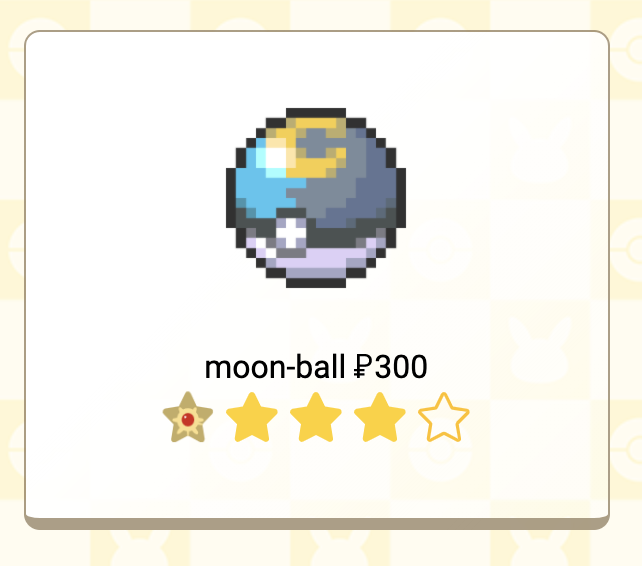
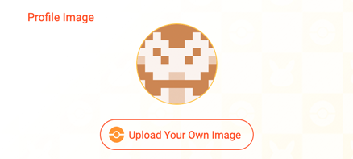
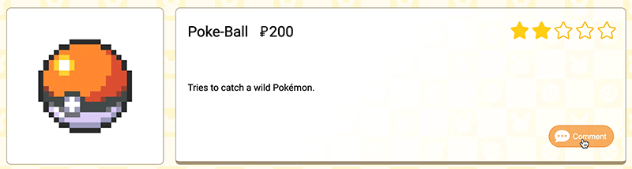
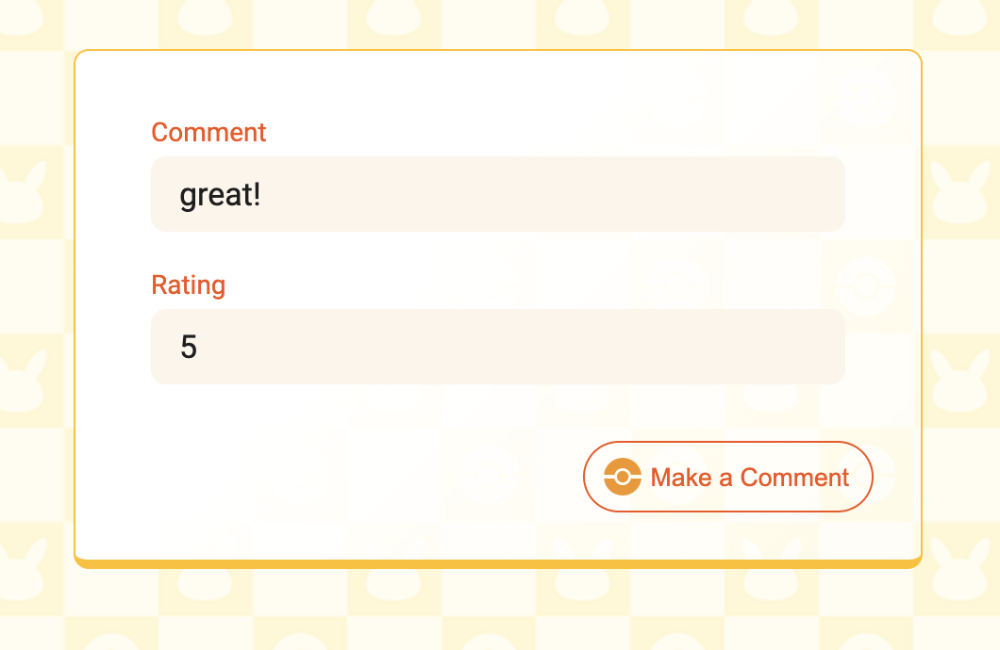
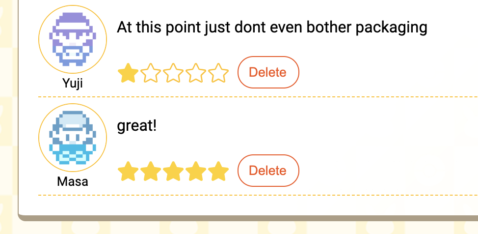
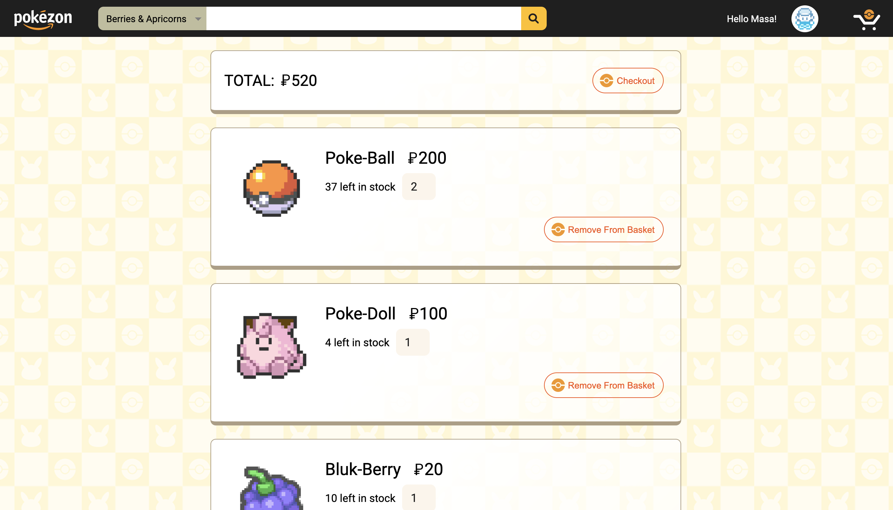
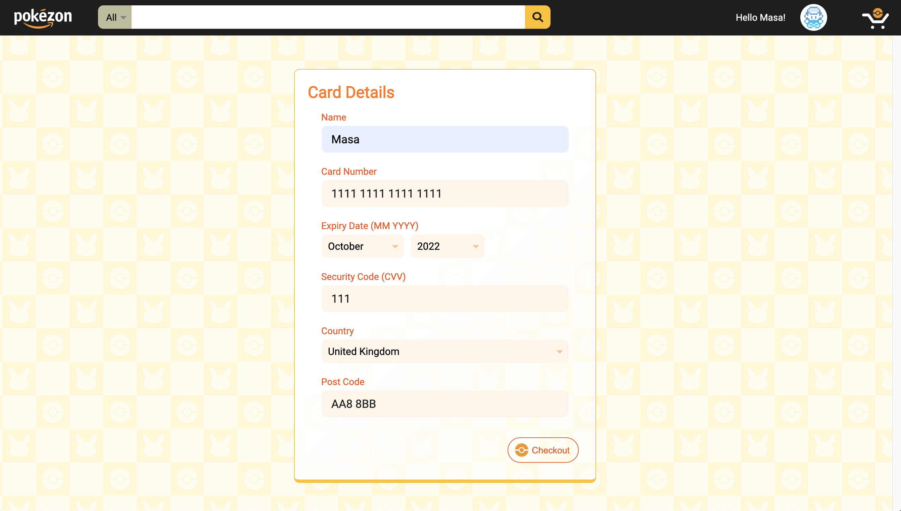
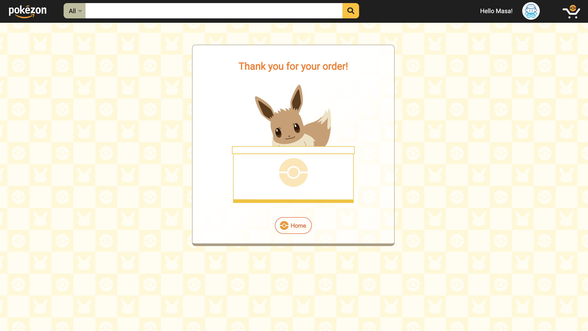

# Project 3: Pokézon

## Index
* [Overview](./README.md#overview)
* [Brief](./README.md#brief)
* [Technologies Used](./README.md#technologies-used)
* [Approach](./README.md#approach)
	* [Mockup](./README.md#mockup)
	* [Setting up the Back End](./README.md#setting-up-the-back-end)
	* [Creating Seed Data for the Database](./README.md#creating-seed-data-for-the-database)
	* [Nav Bar](./README.md#nav-bar)
      * [Search Bar](./README.md#search-bar)
      * [Displaying Items Based on Search Bar Query](./README.md#displaying-items-based-on-search-bar-query)
  * [Hover Effects](./README.md#hover-effects)
  * [Login State](./README.md#login-state)
  * [Pagination](./README.md#pagination)
  * [Home Screen](./README.md#home-screen)
    * [Carousel](./README.md#carousel)
    * [Randomly Picked Items](./README.md#randomly-picked-items)
  * [Animated Components](./README.md#animated-components)
    * [Loading Screen](./README.md#loading-screen)
    * [Moving Background](./README.md#moving-background)
    * [Other Animated Pokémon](./README.md#loading-screen)
  * [User Registration and Login Forms](./README.md#user-registration-and-login-forms)
    * [Registration](./README.md#registration)
    * [Form Animation](./README.md#form-animation)  
* [Other Features](./README.md#other-features)
    * [User Comments](./README.md#user-comments)
    * [Purchasing Items](./README.md#purchasing-items)  
* [Final Thoughts](./README.md#final-thoughts)
	* [Wins and Challenges](./README.md#wins-and-challenges)
	* [Key Learnings](./README.md#key-learnings)


(Click [here](https://pokezonshop.herokuapp.com/) to see project. Following login detail can be used for access: email: 'masa@email.com' , password: 'pass'.)


<br/>

## Overview 

For our third Project at General Assembly's Software Engineering Immersive Course, we were given 10 days to create a fullstack web application, in group of three. At the time, this was the biggest project I had ever worked on, and also the first time to develop a website using Git as a team. 

Since the Course was taken remotely, we communicated extensively through Slack, Zoom, Trello and GitHub. As well as gaining further coding experience, it was a great opportunity to get a taste of collaborative web development.

We based our project on the popular online shopping platform, Amazon, but with a twist - the store would sell fictional products from the Pokémon game. Most of the assets and data comes from the original game, which had been collected and shared by Pokémon fan online (a lot of it came from [Veekun](https://veekun.com), which was an excellent resource). Information about the products were recompiled and edited slightly to suit the concept of our project.

<br/>

## Brief
* To build a full-stack application, making our own back end and front end.
* To use an Express API to serve data from a Mongo database.
* To build the frontend using React to consume the API.
* The API should have multiple relationships and CRUD functionality for at least a couple of models.


## Technologies Used
* HTML5
* CSS3 with animation
* JavaScript (ES6)
* React
* MongoDB
* Express
* Insomnia
* Heroku
* Trello
* Git
* GitHub
* Cloudinary
* Google Chrome dev tools
* Google Sheets
* VS Code
* Eslint
* Photoshop
* Illustrator


<br/>


## Approach
### Mockup

First, we planned the rough structure of our website by looking at the real Amazon site. Since we only had a limited time, we decided to focus on key features of Amazon, which we felt were:
  * User registration
  * User login
  * Searching for item
  * Adding item to shopping item
  * Checking out (buying the item)*
  * Leaving a review / comment in the item page
  * Deleting comments
(* Since this was not a real shipping website, the 'checkout' is just a dummy page not connected to the back end. The payment detail/address etc would not be stored anywhere.)

The design of the website was also inspired by Amazon, in particular the Nav bar. However, various animation and effects were added for fun.

<p align="center">
	  
</p>

Based on the mockup, we were able to roughly work out what task we needed to build the site - the task was split amongst ourselves using Trello, which we reviewed and updated each day.

<p align="center">
	  
</p>

<br/>

### Setting up the Back End

During the project, we mainly worked individually on our own parts and merged them together with Git. However, to get started we set up the boiler plate and basic models together, using Zoom to screen share. The key models we made were the 'user' model and the 'item' (product) model below. Smaller models for 'comment' and 'shippping basket' was also made as the project progressed. At the start, the 'user' model only had the minimum field required for testing registration and login. More fields were added as we built up the website.

```
const userSchema = new mongoose.Schema({
  username: { type: String, required: true, unique: true, maxlength: 40 },
  email: { type: String, required: true, unique: true },
  password: { type: String, required: true },
  image: { type: String, required: true },
  address: { type: String, required: true }, 
  dob: { type: String, required: true },
  basket: [basketItem],
  total: {type: Number, default: 0},
  recentPurchases: [pastItem]
})
```

```
const itemSchema = new mongoose.Schema({
  name: { type: String, required: true, unique: true },
  stock: { type: Number, required: true },
  description: { type: String, required: true, maxlength: 400 },
  price: { type: Number, required: true },
  category: { type: String, required: true },
  image: { type: String, required: true },
  comments: [commentSchema],
})
```

<br/>

### Creating Seed Data for the Database

Within the group I mainly worked on the front end, leading the styling and animation. However at the start of the project, I was responsible for building the seed data for the database. There was a massive database put together by Pokémon fans online on GitHub, which was also run by Veekun, which can be found [here](https://github.com/veekun/pokedex). This database had vast amount of data relating to the game, some as csv files. I combed through these csv files to collect the information we needed about the items, and created a formula on Google Sheets to convert them into list of objects that can be pasted into JavaScript.

<p align="center">
	  
</p>

<p align="center">
	  
</p>

There were over 700 items to be potentially used, but I selected around 460 of these, removing items that were for example too obscure. Some of the in-game category made little sense in real life, so they were reclassified into 17 groups such as 'medicine' and 'food & drink'.

I was also able to get images of the items from [Veekun's website](https://veekun.com), however they were individual png files. To use the images on our project, I uploaded the images onto Cloudinary. Before doing this, I needed to sort several hundred image files to get all the images we needed. This would have taken a long time to do manually, so I used a command line command instead.

First, I made a text file which listed where the files were on my Macbook.

<p align="center">
	  
</p>

Then, I typed the following into my command line - this command referenced the text file mentioned earlier to copy the chosen files, then created a copy into the specified folder called 'new folder'.

```
cp `cat /Users/masa/Desktop/testcopy.txt` /Users/masa/Desktop/new_folder

```
Once the files were sorted, I batch processed them on Photoshop to resize them, then uploaded them onto Cloudinary.

<p align="center">
	  
</p>

The final hurdle was to identify the Cloudinary URL for each images. This was trickier than I anticipated because the URLs were time stamped when uploaded, and due to the volume of files, the time stamps were not all uniform. I needed a list of all the URLs so that I could associate them with the right item. On the Cloudinary interface, the normal method of retrieving the URL involved clicking each image thumbnails, but repeating this for several hundred images would not be ideal.

Fortunately, I found that you could download the list of URLs by making a direct request to Cloudinary API from the command line, using a cURL request below:

```
curl https://<API_KEY>:<API_SECRET>@api.cloudinary.com/v1_1/<CLOUD_NAME>/resources/image
```

The request above returned a JSON string, which I was able to parse and filter to produce the list of URLs I needed. Once I had these, I was able to tie them up by using `VLOOKUP` on Google Sheets.

<p align="center">
	  
</p>

The final seed data looked like below. 

```
export default [
  {
    name: 'master-ball',
    stock: 2,
    description: 'Catches a wild Pokémon every time.',
    price: 100000,
    category: 'pokeballs',
    image: 'https://res.cloudinary.com/dcwxp0m8g/image/upload/v1610396541/pokezon_db/master-ball.png'
  }, {
    name: 'ultra-ball',
    stock: 50,
    description: 'Tries to catch a wild Pokémon. Success rate is 2×.',
    price: 800,
    category: 'pokeballs',
    image: 'https://res.cloudinary.com/dcwxp0m8g/image/upload/v1610396559/pokezon_db/ultra-ball.png'
  }, {
    name: 'great-ball',
    stock: 45,
    description: 'Tries to catch a wild Pokémon. Success rate is 1.5×.',
    price: 600,
    category: 'pokeballs',
    image: 'https://res.cloudinary.com/dcwxp0m8g/image/upload/v1610396533/pokezon_db/great-ball.png'
  }, {

    //* ... rest abbreviated ... *//

```

I was able to make a seed data for the user also using Google Sheets, using a method similar to what I did for items. The seed data was used to populate the database, and also used to refresh and repopulate the database while developing the website. 

<br />

### Nav Bar

Once the seed data was completed, the first component I worked on was the Nav bar. As with the original Amazon site, the Nav bar is constantly visible, allowing users search items at anytime. It also features the main menu allowing users to register, login and logout, and the link to the shopping basket.

<p align="center">
	  
</p>

<br />

#### Search Bar

The search bar is made up of three main components - select box (the drop down), input field and the submit button. These elements are wrapped within a form.

```
      <div className="search_wrapper">
        <form className="search"
          onSubmit={handleSubmit}
        >
          <select
            onChange={handleSelect}
            value={category}
          >
            <option value="All">All</option>

             //* ... options listed here ... *//

            <option value="Jewels">Jewels</option>
          </select>  
          <input 
            style={{ width: `${searchWidth}` }}
            onChange={handleInput}
            value={searchCriteria}
          />
          <button>
            
          </button>  
        </form>
      </div>
  ```
One thing I noticed about the drop down in the original Amazon site is that the width of the drop down changes according to the width of the option selected. 

<p align="center">
	  
</p>

I was able to recreate this by adding an inline style in the select element. 

```
          <select
            style={{ width: `${categoryWidth}px` }}
            onChange={handleSelect}
            value={category}
          >
            <option value="All">All</option>

             (... options listed here ...)

            <option value="Jewels">Jewels</option>
          </select>  

```

The state variable 'categoryWidth' is adjusted using function below. It would basically set the width of the select element by referringg to the selected value, taking into consideration that some letters such as 'I' and 't' would be thinner than others. Since letter width would differ depending on the font, it took some trial and error to achieve the right balance.

```
const resizeCategoryWidth = e => {
    const thinLetters = ['I','i','j','l','t','r']
    let textLength = 0
    e.target.value.split('').forEach(letter=>{
      if (thinLetters.indexOf(letter) !== -1) textLength += 5
      else if (letter === '&') textLength  -= 7
      else textLength += 9
    })
    setCategoryWidth(textLength + 30) 
  }

```
<br />

#### Displaying Items Based on Search Bar Query

When users type in the search criteria in the input field, it is set to state as the 'searchCriteria'. The category selected in the dropdown field is also set to state as the 'category' variable. These are passed on to the URL when the user clicks on the on the search icon (magnifying glass icon), using the function below. If no category is chosen, the 'chosenCategory' is set to 'all', and 'chosenSearchCriteria is set to '0' if none is specified. User is taken to the new URL using the `useHistory` hook imported from 'react-router-dom'.

```
  const handleSubmit = e =>{
    e.preventDefault()
    const chosenCategory = category ? category.toLowerCase() : 'all'
    const chosenSearchCriteria = searchCriteria ? searchCriteria.toLowerCase() : '0'
    history.push(`/pokeindex/${chosenCategory}/${chosenSearchCriteria}/1`) 
  }
```


In the example below, user is taken to `https://pokezonshop.herokuapp.com/pokeindex/pokeballs/ultra/1` since they selected 'Pokeballs' in the dropdown and typed 'ultra' in the input field. 


<p align="center">
	  
</p>

The search query in the URL is accessed using the `useParams` hook imported from 'react-router-dom', which is used for the filter function below:

```
  const filterItems = (items)=> {
    if (category === 'all' && searchCriteria === '0') return items
    let result = items
    result = category === 'all' ? result : result.filter(item => item.category === category )
    result = searchCriteria === '0' ? result : result.filter(item => item.name.includes(searchCriteria))
    return result
  }
```
Due to time constraint, the filter only checks the item's category and name. There is room to enhance this feature by having the filter also check through other fields, such as user comments and item description.

<br />

### Hover Effects

Various hover effects were applied to buttons. In previous projects I had often animated the button itself on hover, but this time I experimented with animating the icon displayed inside the button. 

For the Pokéball, `bottom`, `transform: scale` and `transform rotate` was manipulated to create the effect of Pokéball being bounced, with keyframes below:

```
@keyframes rotating {
  0% {bottom: 0; transform: scale(1) rotate(0deg);}
  45% {bottom: 5px; transform: scale(0.9,1.1) rotate(360deg);}
  50% {bottom: 0; transform: scale(1.2,0.8);}
  60% {bottom: 0; transform: scale(1.08,1); }
  100% {bottom: 0; transform: scale(1);}
}
```

The silhouette of Pikachu for the login has a similar keyframe, without the `transform rotate`.

```
@keyframes hop {
  0% {bottom: 0; transform: scale(1);}
  50% {bottom: 5px; transform: scale(0.9,1.1);}
  55% {bottom: 0; transform: scale(1.08,0.9);}
  70% {bottom: 0; transform: scale(1.08,1);}
  100% {bottom: 0; transform: scale(1);}
}
```
<p align="center">
	  
</p>

<br />

### Login State

When user is logged in, the register and login button is replaced with the user icon, which can be hovered to display the Log Out button. 


<p align="center">
	  
</p>


The 'isAuthenticated' function below checks if user is logged in or not by checking the validity of the token placed on the browser's local storage. The function is used to set the variable 'isloggedIn', used to conditionally render elements on the Nav bar.

```
export function isAuthenticated() {
  const payload = getPayload()
  if (!payload) return false 
  const now = Math.round(Date.now() / 1000) 
  return now < payload.exp
}
```
<br />


### Pagination

The number of items shown on each page were controlled by slicing the items array before mapping them onto the page. This was controlled using the following variable (the 'page' variable also uses the `useParams` hook).

```
const { page } = useParams()
const itemToDisplay = 12
const firstItem = (page - 1) * itemToDisplay
```

Using the variables above, the relevant part of the items array is sliced. For example, page one would have the first 12, page two will have the second set of 12 and so on. in other words, 'slicedItems' is equal to `items.slice(0, 12)` on page one, and equal to `items.slice(12, 24)` on page two. 

```
if (items) {
  slicedItems = items.slice(firstItem, page * itemToDisplay)
}
```

<br />

When the user navigates to a page by clicking on the page number or the arrow button,  the page number in the URL changes, which in turn changes which section of the item array is sliced.

```
function prevPage(){
  history.push(`/${Number(page) - 1}`)
}

function nextPage(){
  history.push(`/${Number(page) + 1}`)
}

function goToPage(pageNo){
  if (pageNo === '...' || pageNo === '...+' ) return
  history.push(`/${pageNo}`)
}
```

<br />

Each buttons for navigating the page is mappped onto the bottom of the page, referencing the current page number and maximum page number. This is done by first creating an array to be map out, using the switch statement below. For example, if the user is on page five, and there are 10 pages to display, the page array would be `['1','...','...','4','5','6','...+','10']`. `Set` is used to remove any excess buttons in the page array ('...+' was used along side '...' so that it isn't seen as a duplication). For the example array mentioned earlier, the array would become `['1','...','4','5','6','...+','10']` once the duplicates are removed. The idea is, only page one, max page, current page, page before current and page after current is displayed. All other pages are abbreviated (otherwise, if you had 40 pages there would be 40 buttons, which would clutter the navigation).


```
function mapPageLinks(maxvalue){
  const pages = []

  for (let i = 1; i <= maxvalue; i++ ){
    switch (i) {
      case 1: pages.push(i)
        break
      case Number(page): pages.push(i)
        break    
      case (Number(page) - 1): 
        pages.push(i)
        break
      case (Number(page) + 1): 
        pages.push(i)
        break  
      case maxvalue - 1: 
        pages.push('...+')
        break  
      case maxvalue: pages.push(i)
        break
      default: pages.push('...')
    }
  } 
  
  const buttonsToDisplay =  [...new Set(pages)]
  
  return buttonsToDisplay.map(eachPage=>{
    return (
      <button className={`page_button ${eachPage === Number(page) ? 'current' : ''} ${eachPage[0] === '.' ? 'null' : ''}`} key={`page${eachPage}` } alt="button" onClick={()=>{
        goToPage(eachPage)
      }}>{eachPage === '...+' ? '...' : eachPage}</button>
    )
  })
}

```
<br />

Once the page array is created, they are mapped onto the page, and each buttons are assigned their own 'onClick' event to trigger the 'goToPage' function mentioned earlier. The buttons are also styled according to what they are:
  * The div is given the "current" class to highlight current page (eg if user is on page two, div with no.2 would have class of "current" to be styled differently).
  * style called 'null' is used to clarify that the button does nothing (it has no hover effect, and cursor is set to default).

In the screenshot below, the user is on page four. Based on the filtered result, the final page is seven.

<p align="center">
	  
</p>

The prev button is hidden when on first page, and the next button is hidden when on final page using conditional rendering.

<p align="center">
	  
</p>

<p align="center">
	  
</p>

<br />

### Home Screen

I also worked on the home page, which consisted of two sections: the carousel banner, and divs displaying random items.


#### Carousel

The carousel is essentially a wide div wrapped within a narrower div. The position of the wide div is adjusted using inline styling, which references a variable called 'heropos'. This variable is altered using a function which is called every 4.5 seconds using `setTimeout`.

```
  <div className="home_hero_wrapper">
    <div className="left_arrow"  onClick={prevHero}>
      
    </div>  
    <div className="inner_wrapper">
      
      <div className="hero" style = {{ left: `${heroPos}%` }}>
          
      </div>

      <div className="hero" style = {{ left: `${heroPos}%` }}>
          
      </div>

      <div className="hero" style = {{ left: `${heroPos}%` }}>
          
      </div>

        //* ... three more divs similar to above with different images ... 
  
    <div className="right_arrow" onClick={nextHero}>
      
    </div> 
  </div>

```
<br />

The user is able to interrupt the `setTimeout` and manually switch to different section of the carousel by clicking the left and right arrow button. The function for controlling this action clears any ongoing `setTimeout` using `clearTimeout` to prevent the automatic switching to interfere with the manual switching.

```
 const nextHero = () =>{ 
    clearTimeout(timer)
    const newPos = heroPos > -400 ? heroPos - 100 : 0
    setHeroPos(newPos)
  }

  const prevHero = () =>{
    clearTimeout(timer)
    const newPos = heroPos < 0 ? heroPos + 100 : -400
    setHeroPos(newPos)
  }
```  

<br/>

After the carousel is switched, it carries on with the cycle since the change to 'heropos' variable would trigger a `useEffect`, which sets a new  `setTimeout `. The `useEffect` also has a cleanup function to clear any ongoing `setTimeout` when the user navigates away from the page.

```
  React.useEffect(() => {
    timer = setTimeout(()=>{
      nextHero()
    }, 4500)
    return () => {
      clearTimeout(timer)
    }
  }, [heroPos])
```

<p align="center">
	  
</p>

Using a ternary operator, the carousel returns to the first image when it reaches the final one ( it switches to the final image if you click on the left arrow when on first image as well).

<br/>

#### Randomly Picked Items

When the data is fetched from the API, random item is picked based on several criteria, then set to state.

```
  React.useEffect(() => {
    const getData = async () => {
      try {
        const { data } = await getItems()
        setItems(data.sort((a, b) => a.price - b.price))
        setRandomItems(makeRandomArray(data))
        setRandomPokeball(pickRandomItem(data,'pokeballs'))
        setRandomBerry(pickRandomItem(data,'berries & apricorns'))
        setRandomCheapItem(pickRandomCheapItem(data))
      } catch (err) {
        setHasError(true)
      }
    }
    getData()
    nextHero()
  }, [])
  ```
<br />

The random selection is made using functions below. The variable 'pickRandomCheapItem' filters out 'berries & appricorn', and the function 'makeRandomArray' filters out 'pokeballs' as well as 'berries & appricorn', to reduce the chance of similar items appearing on the page (since many of the pokeballs and berries are also cheap, they are also likely to appear as random cheap item unless they are filtered). 


```
 function pickRandomItem(array,category){
    const filteredArray = array.filter(item=>{
      return item.category === category
    })
    return filteredArray[Math.floor(Math.random() * filteredArray.length)]
  }

  function pickRandomCheapItem(array){
    const filteredArray = array.filter(item=>{
      return item.category !== 'berries & apricorns' && item.price < 200
    })
    return filteredArray[Math.floor(Math.random() * filteredArray.length)]
  }

  function makeRandomArray(array){
    const randomItems = []
    const filteredArray = array.filter(item=>{
      return item.category !== 'pokeballs' && item.category !== 'berries & apricorns'
    })
    for (let i = 0 ; i < 4; i++){
      randomItems.push(filteredArray[Math.floor(Math.random() * filteredArray.length)])
    }
    return randomItems
  }

```

<br />

The filtered arrays are then mapped onto the page. Users will see a different selection each time they visit the home page.

<p align="center">
	  
</p>

<p align="center">
	  
</p>

<p align="center">
	  
</p>

<br />

### Animated Components

I made number of other animated components placed around the website.

<br />

#### Loading Screen

<p align="center">
	  
</p>

This component displays a loading bar, with Pikachu running above it. The bar and Pikachu is animated using two separate css keyframe animations below:


```
.inside {
  float: left;
  width: 0%;
  height: 50px;
  background-color: rgb(255, 204, 93);
  transition: 1s;
  animation: bar_load forwards 1s; 
}

@keyframes bar_load {
  0%{ width: 0%;}
  100%{ width: 100%;}
}

.pika {
  animation: pika_load forwards 1s; 
}

@keyframes pika_load {
  0%{ left: 0%;}
  100%{ left: calc(100% - 100px);}
}

```

<br/>

#### Moving Background

<p align="center">
	  
</p>

The background is tiled, and scrolls to the upper right direction slowly. This effect is created by applying keyframe animation to the `background-position`, which is applied to the body:


```
body {
  padding: 0;
  margin: 0;
  font-family: $main_font;
  background-color: $light_color;
  background: url($bg) repeat 0 0;
  animation: bg_scrolling 8s infinite linear; 
}

```

```
@keyframes bg_scrolling {
  0% { background-position: 0 100px; }
  100% { background-position: 100px 0; }
}
```

<br />

#### Other Animated Pokémon

I placed number of other animated images of Pokémon around the website, some for error messages. They would be displayed on situations such as when the server is down, or when users are not logged in. I drew the svg files on Illustrator, then animated them using css keyframe animation.

<p align="center">
	  
</p>

<p align="center">
	  
</p>

<p align="center">
	  
</p>

<br/>

Eevee took the longest time to animate, since it had separate motion for the ears, the head, and tail. It would pop out from behind the desk to greet the user.

<p align="center">
	  
</p>

<br/>

##### Random Stayus

Stars are displayed around the website to show item's rating. When the ratings are mapped onto the page, there is one in 60 chance that a Stayu (starfish Pokémon) is displayed instead. (These are also subtly animated. Screenshot below is static, so try to find them on the actual website!)

<p align="center">
	  
</p>

<br/>


### User Registration and Login Forms

#### Registration

Whilst majority of the error handling such as validating emails and password were handled in the front end, some error handling were done in the back end (such as checking uniqueness of the username, which had to be done by referring to existing names in the database). These were put together by another team member, but I worked on the styling and the functionality to upload profile image onto the server. 

By clicking on the upload button, the user is able to select an image, which gets uploaded to Cloudinary. Once the image is uploaded, the URL of the image is requested from Cloudinary and set into state. Once set to state, an image preview is displayed, and the image URL is ready to be uploaded to the user database along with rest of the form fields.

<p align="center">
	  
</p>

<p align="center">
	  
</p>

Styling the form was relatively straight forward, but tricky for this image upload. This is because it involved hiding the default browser input, then overwriting it with a custom label. A label was placed with `htmlFor` to act on behalf the actual input field. 

```
 <div className="upload_button_wrapper">
    <div className="input_wrapper">
      <label className="upload_button" htmlFor="upload" > 
         
          Upload Your Own Image
      </label>
      <input
        id="upload"
        type="file"
        accept="jpg"
        onChange={handleUpload}
        name={name}
      />
    </div>  
  </div>
```

<br/>

#### Form Animation

The form has separate animation depending on if the submission was succssful or not.

When there is an error on the form, for example when the field is entered incorrectly, the form shakes along with error message(s) being displayed. This is done by adding a class to the form with a keyframe animation which alters the `margin-left` repeatedly.

<p align="center">
	  
</p>

```
@keyframes shake {
  0% { margin-left: -10px;}
  50% { margin-left: 10px;}
  100% { margin-left: -10px;}
}
```
<br/>

When the form submission is successful, a class is added which animates using `transform: scale` and `margin-top`, which makes the form shoot upwards.

<p align="center">
	  
</p>

```
@keyframes accepted_effect {
  0% { transform: scale(1) ; margin-top: 0;}
  70% { transform: scale(1.2,0.8); margin-top: 10vh; }
  80% { transform: scale(0.9,1.1); margin-top: -10vh; }
  100% { transform: scale(1) ;  margin-top: -200vh;}
}
```

<br/>

## Other Features

There are other key features of the website which my team members mainly worked on (I assisted with most of the styling and adding some animation). I have listed these below:

<br />

### User Comments

When logged in, users can add reviews and rating by clicking on the comment button and completing a form. 

<p align="center">
	  
</p>

<p align="center">
	  
</p>

<p align="center">
	  
</p>

The user who added the comment can also delete the comment (error message appears if different user tries to add comment).


<br />

### Purchasing Items

<p align="center">
	  
</p>

Users can add item into the shopping basket by clicking on the 'Add to Basket' button. 

<p align="center">
	  
</p>

Items added to the basket can then be reviewed by clicking on the shopping basket icon. Users can also Checkout from this page.

<p align="center">
	  
</p>

This takes the user to a page where they can enter the payment detail and address. This is a 'fake' page, so the data is not saved in the back end. In real life we would probably hook this up to a third party e-commerce framework. However, the page does have a validation feature which for example checks if the credit card number has the right number of digits.

<p align="center">
	  
</p>

Users can then submit the payment details to complete the purchase.

<br />

## Final Thoughts

### Wins and Challenges
This was the largest project I had ever worked on at the time, and also the first time I had collaborated using Git to push and pull branches. Although I worked mainly on the front end, I discussed frequently with the team member who was working on the back end. 

We mainly worked on our own section, but sometimes worked on issues together when we were stuck. I felt that the process of explaining my own codes helped me see them objectively, helping me to refine them.

<br />

### Key Learnings

Since I was working with massive amount of assets and data, it pushed me to use approaches I never would have attempted other wise, such as the use of command line command to sort files, and retrieving data from Cloudinary API using cURL request. I also used Google Sheets extensively for sorting and formating data.

Above all, the main lesson learnt from the project was the experience of coding as a team. In prior group work I already appreciated the importance of good mockups to calibrate our end goal. This was even more crucial in this project due to its scope. Since this project was ambitious in scale, there were several features we could not polish to the level we had hoped, however it certainly pushed us to work at the highest level we could at the time.


(Click [here](https://pokezonshop.herokuapp.com/) to see project.)